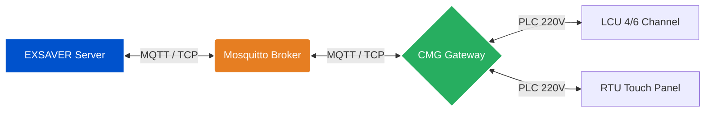
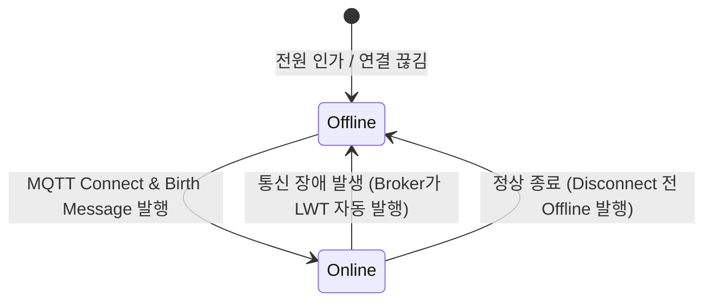

# EXSAVER 2.0 Edge Gateway (CMG) 연동 규격서 - [Part 1] 아키텍처 및 네트워크

**문서 버전**: v1.0.0-draft.11

[⬅️ 통합 안내서 및 변경 이력으로 돌아가기](README.md)

## 1. 시스템 아키텍처 및 역할 정의

본 시스템은 중앙 서버와 현장의 CMG 간 MQTT 프로토콜을 사용하여 비동기 통신을 수행합니다. CMG는 하위 LCU/RTU와 전력선 통신(PLC)을 수행하며, 서버와 현장 장비 간의 제어 및 데이터를 중계하는 미들웨어 역할을 담당합니다.



<br><br><br><br>

---

## 2. MQTT 통신 기본 규약

### 2.1. 브로커 접속 정보

- **Host**: `mqtt.exsaver.net` (예정, 임시 IP 별도 제공)
- **Port**: `1883` (TCP) / `8883` (TLS)
- **Protocol**: MQTT v3.1.1 또는 v5.0
- **Client ID**: `cmg_{12자리소문자MAC}` (예: `cmg_001122334401`)

<br>

### 2.2. 기기 식별자 (ID) 규칙

- 모든 기기의 ID는 콜론(`:`)을 제외한 **12자리 소문자 MAC 주소**를 기반으로 합니다.
- **CMG ID 예시**: `cmg_001a2b3c4d5e`
- **LCU ID 예시**: `lcu_001a2b3c4d5e`
- **RTU ID 예시**: `rtu_001a2b3c4d5e`

<br>

### 2.3. 토픽(Topic) 구조 (Flattening 적용)

EXSAVER 2.0의 MQTT 토픽은 단일 CMG(Edge Gateway)를 기준으로 **명령(Command), 응답(ACK), 이벤트(Event), 주기적 데이터(Data), 상태(Status)** 5가지 계층으로 분리하여 관리합니다. 모든 토픽의 최상위 경로는 `exsaver/cmg/{cmg_id}/`로 시작합니다.

| 방향 (Pub ➔ Sub) | 토픽 경로 (Topic Path)                    | QoS    | 설명 및 포함되는 페이로드 타입                                                                                                                                                                                                                                                                                                                                               |
| :--------------- | :---------------------------------------- | :----- | :--------------------------------------------------------------------------------------------------------------------------------------------------------------------------------------------------------------------------------------------------------------------------------------------------------------------------------------------------------------------------- |
| **Server ➔ CMG** | `exsaver/cmg/{cmg_id}/cmd`                | 1      | **[하향 명령]** 서버가 CMG로 제어 및 설정 명령을 내릴 때 사용합니다.<br>• `MANAGE_GROUP`, `GROUP_CONTROL`<br>• `MANAGE_SCHEDULE`<br>• `REQUEST_SYNC_DIGEST`<br>• `SET_RTU_TARGET_LCU` 등                                                                                                                                                                                     |
| **CMG ➔ Server** | `exsaver/cmg/{cmg_id}/cmd_ack`            | 1      | **[명령 응답]** CMG가 서버의 `cmd`를 수신하고 처리한 결과를 회신할 때 사용합니다.<br>• `status: "COMPLETED" / "FAILED"`<br>• `GET_XXX` 명령어의 결과 `data` 포함                                                                                                                                                                                                             |
| **CMG ➔ Server** | `exsaver/cmg/{cmg_id}/event/{event_type}` | 1      | **[비동기 이벤트]** CMG에서 자발적/예외적 상태 변화가 발생했을 때 즉시 보고합니다. 토픽 끝에 이벤트 타입을 명시하여 워커의 라우팅 속도를 높입니다.<br>• `.../event/state_change` (단일 물리 조작)<br>• `.../event/execution_report` (그룹/스케줄 제어 결과 요약)<br>• `.../event/entity_change` (멀티마스터 역동기화)<br>• `.../event/sync_digest` (무결성 검사용 해시 보고) |
| **CMG ➔ Server** | `exsaver/cmg/{cmg_id}/lcu/{lcu_id}/data`  | 0 or 1 | **[주기적 텔레메트리]** 1분(또는 설정된 주기) 단위로 수집된 각 LCU의 전압, 전류, 전력량, 역률 등의 계측 데이터를 전송합니다. (QoS 0 권장)                                                                                                                                                                                                                                    |
| **CMG ↔ Server** | `exsaver/cmg/{cmg_id}/status`             | 1      | **[기기 생존 상태]** 연결 상태 관리를 위해 사용합니다.<br>• LWT(Last Will and Testament): `{"status": "offline"}`<br>• Birth Message (재부팅 시): `{"status": "online"}`                                                                                                                                                                                                     |

#### 💡 와일드카드 구독 (서버 Worker 전용)

서버의 백엔드 MQTT 워커(Worker)는 모든 CMG의 메시지를 한 번에 수신하기 위해 다음과 같이 와일드카드(`+`) 토픽을 구독(Subscribe)하여 중앙 처리합니다.

- `exsaver/cmg/+/cmd_ack`
- `exsaver/cmg/+/event/+`
- `exsaver/cmg/+/lcu/+/data`
- `exsaver/cmg/+/status`

### 2.4. QoS (Quality of Service) 정책

통신 신뢰성과 네트워크 대역폭의 균형을 위해 트래픽 특성에 따라 QoS를 분리 적용합니다.

- **QoS 0 (At most once)**: `data` 토픽 적용. (대량의 수집 데이터는 트래픽 최적화를 위해 전송 보장을 생략함)
- **QoS 1 (At least once)**: `cmd`, `event`, `status` 토픽 적용. (제어 명령, 응답, 그리고 연결 상태 보고는 유실 방지를 위해 반드시 1회 이상 수신되어야 함)

<br><br><br><br>

---

## 3. 기기 상태 관리 및 LWT (Last Will and Testament)

네트워크 단절 시 서버가 CMG의 상태를 정확히 인지할 수 있도록, **반드시 LWT를 설정하여 연결(Connect)** 해야 합니다.



<br>

### 3.1. 연결 유지 (Keep-Alive)

- **주기**: `60초`.

<br>

### 3.2. 상태 보고 토픽 (Birth / LWT)

- **Topic**: `exsaver/cmg/{cmg_id}/status`
- **QoS**: `1`
- **Retain**: `true` (서버가 나중에 접속해도 최종 상태를 확인할 수 있도록 유지)

**Payload (Birth Message - 연결 성공 시 CMG가 발행)**

```json
{
  "status": "online",
  "ts": 1773316800,
  "ip_address": "192.168.1.100"
}
```

**Payload (LWT Message - 연결 시 Broker에 사전 등록)**

```json
{
  "status": "offline",
  "ts": 1773316800
}
```

<br><br><br><br>

---

## 4. 장비 프로비저닝 및 유지보수 시나리오

원활한 시스템 결속 및 장비 교체/장애 시나리오 대응을 위해 다음과 같은 절차를 규정합니다.

<br>

### 4.1. 표준 시운전 (Standard Provisioning)

1. **정보 등록**: 현장 설치 시 기기 바코드(MAC, DAK) 서버 업로드.
2. **도면 매핑**: 서버 UI에서 도면 내 설치 위치와 기기 매핑.
3. **통신 결속**: 서버에서 CMG로 `PROVISION` 명령 전송.

   ```json
   {
     "cmd_id": "prov-001",
     "cmd_type": "PROVISION",
     "target_id": "lcu_001122334455",
     "dak_key": "1234567890abcdef",
     "nmk_key": "Arsenal2026"
   }
   ```

4. **결과**: CMG가 DAK를 이용해 해당 LCU에 NMK를 주입하여 사설망 편입 완료.

<br>

### 4.2. 바코드 누락/접근 불가 시 시운전

**[현장 상황]**: 기기 바코드 정보 미등록 후 마감재로 은폐되어 물리적 확인이 불가한 경우, CMG는 해당 미할당 기기를 공용망(Public Network) 상태로 감지하여 데이터를 수신해야 합니다. 서버는 아래 방식으로 위치 추적을 수행합니다.

**① 제어 응답 확인 방식**

- **동작**: 서버가 공용망의 미할당 LCU에 주기적으로 `RELAY_CONTROL` (ON/OFF) 명령을 발송합니다.
- **결과**: 현장 관리자가 물리적 릴레이 작동음을 통해 위치를 식별한 후 시스템에 등록합니다.

**② 부하 변동 확인 방식**

- **동작**: 현장 관리자가 특정 콘센트에 고부하 기기(500W 이상)를 연결 및 작동시킵니다.
- **결과**: 서버는 공용망 수집 데이터 중 `power_w` 값이 해당 부하만큼 급증하는 기기를 식별하여 등록합니다.

<br>

### 4.3. 게이트웨이 기기 교체 (RESTORE_NETWORK)

**[현장 상황]**: 메인 CMG 고장으로 기기를 교체한 상황. 하위 LCU는 이중바닥 아래 설치되어 물리적 접근이 제한됨. 하위 기기의 재시운전 절차를 생략하기 위해, 서버에서 새 CMG에 기존 망 암호를 주입합니다.

1. **망 복구 명령 전송**: 서버가 새 CMG에 `RESTORE_NETWORK` 전송.

   ```json
   {
     "cmd_id": "restore-001",
     "cmd_type": "RESTORE_NETWORK",
     "nmk_key": "Arsenal2026",
     "child_ids": ["lcu_001122334402", "lcu_001122334403"]
   }
   ```

2. **결과**: 수신한 CMG는 NMK를 업데이트하고 사설망에 합류하여 하위 기기 제어를 복원합니다.
