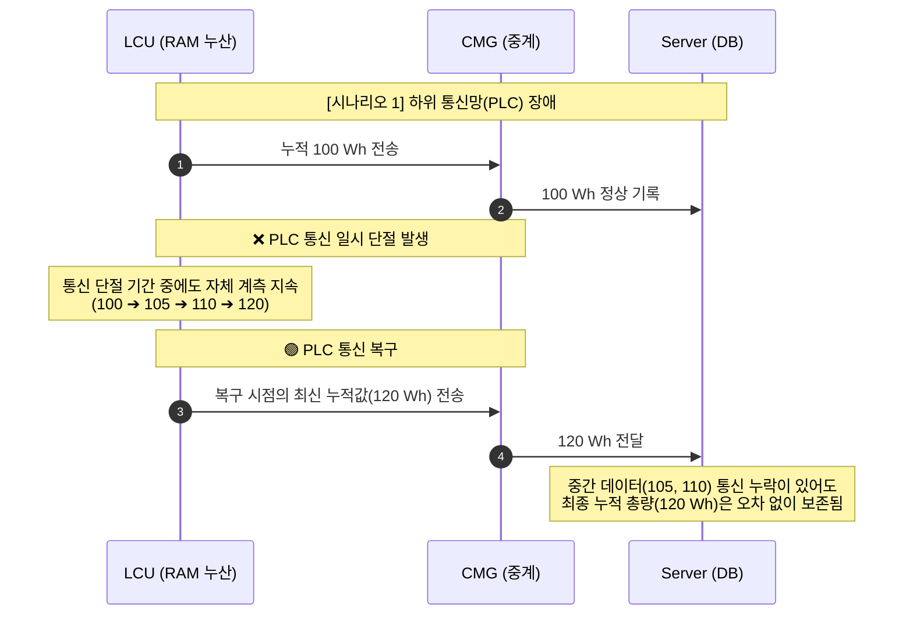
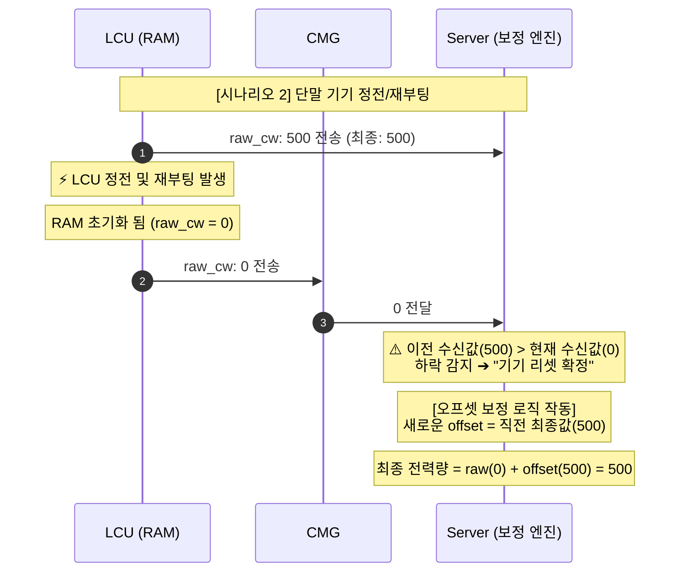
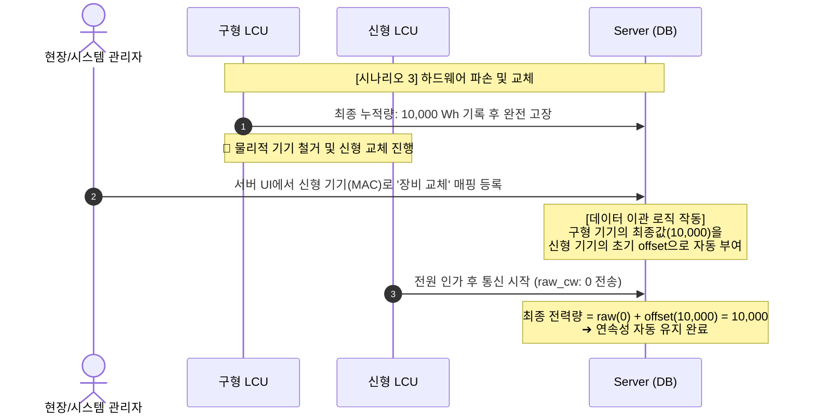
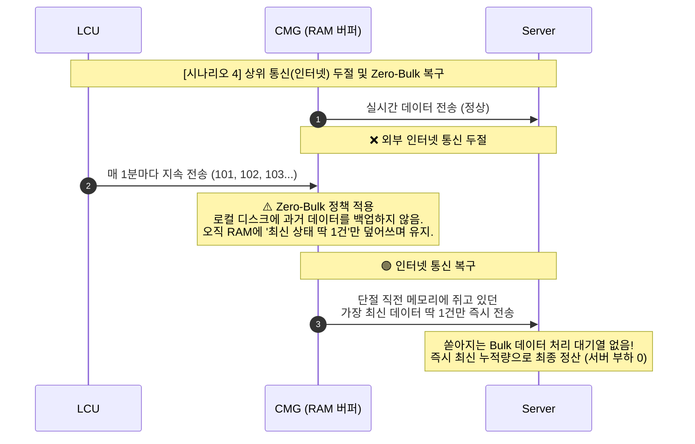
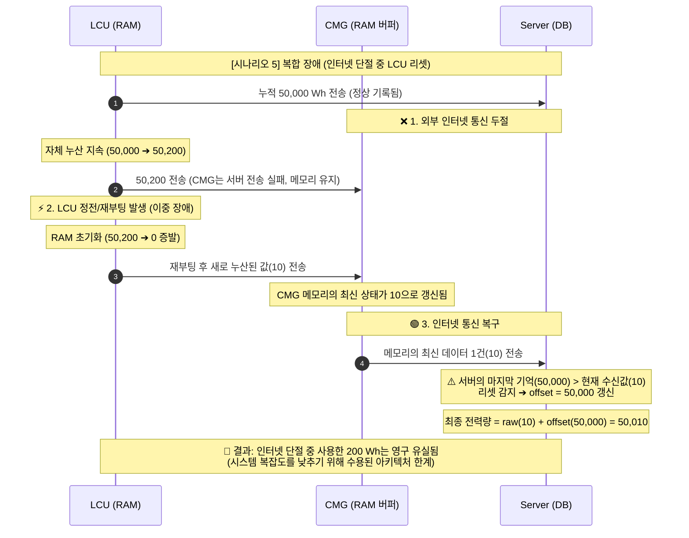

# EXSAVER 2.0 Edge Gateway (CMG) 연동 규격서 - [Part 3] 장애 대응 및 정책

**문서 버전**: v1.0.0-draft.11

[⬅️ 통합 안내서 및 변경 이력으로 돌아가기](index.md)

## 1. 장애 대응 및 데이터 무결성 보장 정책 (Fault Handling & Data Integrity)

시스템은 통신 장애 및 하드웨어 오류 발생 시 전력량 데이터 유실 및 계측 오류를 방지하기 위해 노드별 역할을 명확히 분리한 **'오프셋(Offset) 보정 기반 아키텍처'**로 구성됩니다.

 

### 1.1. 누적 데이터 처리 역할 분담 (Zero-Bulk 전략 도입)

단말(LCU)의 플래시 메모리(eMMC, NAND) 쓰기 수명 한계를 보완하고 무결성을 유지하기 위해 `cw`, `cs` 처리는 아래 원칙을 따릅니다.

1. **LCU (데이터 누산)**: 플래시 메모리에 누적값을 기록하지 않습니다. 휘발성 메모리(RAM)에서만 전력량을 합산하여 CMG로 전송합니다.
2. **CMG (단순 중계 및 상태 유지)**: CMG는 하위 기기의 데이터를 임의 가공하지 않으며, 상위(서버) 통신 단절 시에도 **과거 데이터를 로컬 스토리지에 벌크(Bulk)로 쌓지 않습니다.** 오직 각 기기의 **'가장 최신 수신값 1건'**만 RAM에 유지합니다.
3. **Server (데이터 보정 기준)**: 수신된 기기의 누적값을 원시 카운터(Raw Counter)로 처리하며, 장비 재부팅 또는 교체 시 발생하는 카운터 초기화 현상에 대해 자체 오프셋 보정 로직을 적용하여 최종 전력량을 산출합니다.
   - _산출식_: `최종 전력량 = 기기 수신값(raw_cw) + 서버 내부 보정값(offset)`

 

### 1.2. 장애 시나리오별 대응 규격

대표적인 4가지 통신 및 하드웨어 장애 상황에 대한 시스템의 자동 보정 시나리오입니다.

#### 시나리오 1. 하위 구간 통신 단절 (LCU ↔ CMG 간)

- **상황**: LCU와 CMG 간 전력선 통신(PLC)이 일시 단절됨.
- **처리 방식 (LCU RAM 누산)**: 통신 단절 구간에도 LCU 자체 계측 및 RAM 내 누적 연산은 지속됩니다.
- **결과**: 통신 복원 시 누적된 최신 데이터가 전송되므로 총량 데이터의 유실이 방지됩니다.

#### 시나리오 2. LCU 정전 및 재부팅

- **상황**: LCU 전원 차단 후 재부팅으로 인하여 RAM 누적 카운터가 0Wh로 초기화됨.
- **처리 방식 (서버 오프셋 보정)**:
  1. 서버는 이전 수신값보다 작은 데이터가 수신될 경우 기기의 리셋 상태를 감지합니다.
  2. 서버 데이터베이스의 `offset` 필드에 직전 수신값을 더하여 보정치를 갱신합니다.
- **결과**: 기기 재시작 이후 전송되는 수신값에 보정치가 합산되므로 누적 데이터의 연속성이 유지됩니다.

#### 시나리오 3. 하드웨어 전면 교체 (LCU 교체)

- **상황**: LCU 장비가 파손되어 새로운 장비로 교체 진행.
- **처리 방식 (서버 측 기기 매핑 이관)**:
  1. 현장 관리자가 서버 인터페이스에서 기기 교체 등록을 완료합니다.
  2. 서버는 기존 장비의 최종 누적 전력량을 교체된 기기의 초기 `offset` 값으로 이관합니다.
- **결과**: 기기에 누적값을 주입할 필요 없이 서버의 연산만으로 현장 데이터의 연속성을 보장합니다.

#### 시나리오 4. 상위 통신 장애 (CMG ↔ Server 간 인터넷 두절)

**[변경된 정책: 최신값 복구 로직 - Zero-Bulk]**

- **상황**: CMG에서 서버 브로커망으로 향하는 외부 네트워크 단절 발생. (하위 통신 정상)
- **처리 방식**:
  1. CMG는 외부 네트워크가 단절된 기간 동안 과거 데이터들을 로컬 스토리지에 백업하지 않습니다.
  2. 통신이 복구되면, CMG는 현재 메모리에 유지하고 있는 **각 LCU의 가장 최신 상태 데이터 딱 1건만** `data` 토픽을 통해 서버로 순차 전송합니다.
- **결과**: 서버는 복잡한 과거 데이터 병합(Time Paradox) 로직 없이 즉시 최신 누적량을 정산하며, 시스템 복잡도와 복구 시점의 서버 부하(Thundering Herd)가 원천 차단됩니다.

    

---

## 2. 데이터 흐름 및 저장 관점의 취약점과 한계 (Limitations & Vulnerabilities)

본 시스템은 데이터 보존 및 복구 메커니즘을 포함하나, 하드웨어의 물리적 동작 구조 및 장기 오류 상황에서는 아래와 같은 데이터 유실 취약점이 존재합니다. 본 시스템은 시스템 안정성과 복잡도 감소를 위해 일부 극한 상황에서의 데이터 유실을 아키텍처상 허용(Trade-off)하고 있습니다.

 

### 2.1. 래칭 릴레이 지속 구간의 계측 누락 (Blind Spot)

- **현상**: LCU 펌웨어 업데이트 또는 오류에 의한 MCU 재부팅 상황 (약 10~30초 소요).
- **취약점**: 기기 전원 유지를 위해 래칭 릴레이는 기존 상태(ON)를 유지하여 부하 측 전원은 공급되나, 계측 담당 MCU가 정지 상태이므로 해당 시간 동안의 사용 전력은 LCU 내부에서 연산되지 않습니다.
- **한계**: 릴레이 개방 없이 실제 사용된 전력 데이터이나 연산 장치 정지로 인해 유실되는 한계가 있습니다.

 

### 2.2. 통신 모듈 파손에 따른 장기 데이터 누락 (Dead Node)

- **현상**: LCU 통신/제어 보드(MCU)가 파손되고 릴레이 접점이 유지된 상태로 고장 발생.
- **취약점**: 장비의 물리적 교체 시점까지 통신 두절(Offline) 상태가 장기간 지속됩니다. 이 기간 동안의 사용 전력은 보정이나 복구가 불가하여 유실됩니다.
- **권장 사항**: 오프라인 상태가 장기화된 기기의 대시보드 표출 시, 과거 평균 사용량 등 추정치(Interpolated Data)를 활용하는 보완 로직을 적용할 수 있습니다.

 

### 2.3. CMG 일시적 재부팅 구간의 실시간 차트 누락 (Telemetry Loss)

- **현상**: 시스템 업데이트 또는 오류에 의한 CMG 장비 자체 재부팅 상황.
- **취약점**: 누적 전력량(`cw`, `cs`)은 하위 단말에 보존되어 유실되지 않으나, 1분 주기로 전송되어야 할 실시간 순시 데이터(전력, 전류 등)의 경우 CMG 중계 모듈 부재로 유실됩니다.
- **한계**: 누적 사용량 정산에는 영향이 없으나 대시보드의 실시간 계측 차트에는 선이 끊기는 빈 구간(Gap)이 발생하며 이는 프론트엔드에서 보간(Interpolation)으로 처리됩니다.

 

### 2.4. 이중 장애 시 데이터 유실 (Double Fault)

- **현상**: CMG 장비 파손으로 통신 중계가 불가한 상태에서 현장 전원 차단(정전)이 동시 다발적으로 발생.
- **취약점**: CMG는 통신 단절 기간의 과거 데이터를 저장하지 않습니다(Zero-Bulk). 이 기간 중 LCU마저 정전 등으로 재부팅될 경우, RAM 내 누적 데이터(`cw`)가 0으로 초기화되어 단절 구간의 총 누적량은 영구 유실됩니다.
- **한계**: 플래시 메모리 수명 보호(LCU RAM 누산) 및 시스템 복잡도 제거(Zero-Bulk)를 달성하기 위해 BEMS 도메인 관점에서 수용 가능한 리스크(Acceptable Risk)로 합의된 아키텍처적 한계입니다.

